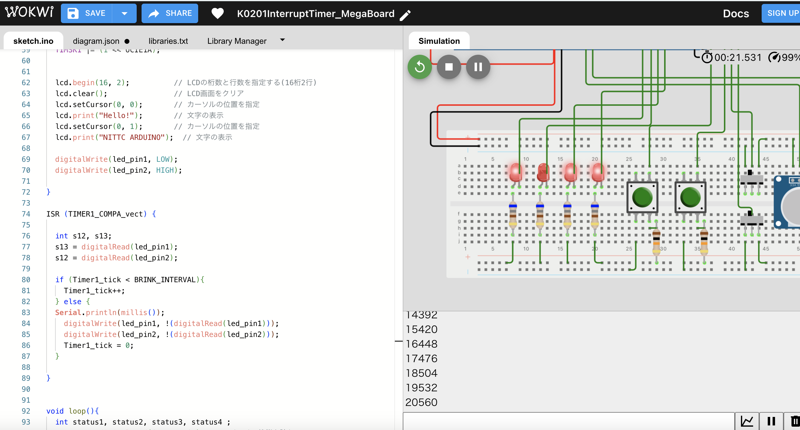

# ArduinoMegaRev3予備実験メモ

## 変更履歴

```
=== 2024/03/10 ===
4E実験用にプログラムやフォルダ構造をリファクタリング、大幅改造

=== 2024/02 ===
arduinoMega用にシミュレーションを追加（SimulationV1）

=== 2023/12 ===
arduinoMegaによる実験テストプログラム作成

```

## 概要
* ４Eで扱う実験課題を大まかに分けて検証しています。

## メモ
* H8マイコンからArduinoMegaに変更
* Tinkercad(Arudino Uno)でシミュレーションを実施

  シミュレータのメモリ限界によりタイマー割り込みによるLED点滅実験まで
* 課題区分概要

    1.Arudino基礎、タイマー割り込み

    2.正弦波発生、CRフィルタ設計

    3.デジタルフィルタ設計

    4.モーター制御（ONOFF、PD制御）

## シミュレーション環境

* arduino UNO環境はtinkercadを利用．

### Wokwi

  * [wowki](https://wokwi.com/)

  * Arduino Megaのシミュレートが可能．ブラウザ環境

  * ブレッドボード可

  * キャパシタ、インダクターがない．

  * 無料利用可．

  * プロジェクトのパーマネントリンク発行可能．

  * 作成例

    [パーマネントリンク；１秒割り込みLチカ](https://wokwi.com/projects/390779763933678593)

    


### SimuLIDE

  * [SimuLIDE](https://simulide.com/p/)

  * オフライン、インストーラでインストール（windows, mac, linux）

    * インストールするときに寄付欄やメールアドレス入力が必要．

  * ブレッドボード等の配線ではない．

  * 素子は豊富．オシロスコープもシミュレート可能．

  * プログラムはarduino IDEでコンパイル、実行ファイルを生成後、SimulIDEのエディタ上でロードする．

  * 2016年あたりの文献はウェブ上で確認できるが情報は少ない．

  * 作成例

    

## 参考

### wokwi

* [ツール・ラボ](https://tool-lab.com/wokwi-usage/)

### simuLIDE

* [公式Youtube](https://www.youtube.com/watch?v=xvSK6eoMHIw&list=PL0YDA67EjDEEasQXWilro9SEyDHN-H6ug)

* [no+e ; ArduinoでNゲージ](https://note.com/kanreki_debut/n/n3877bf451b77)

  arduinoでコンパイルしてsimulIDEによみこむまで