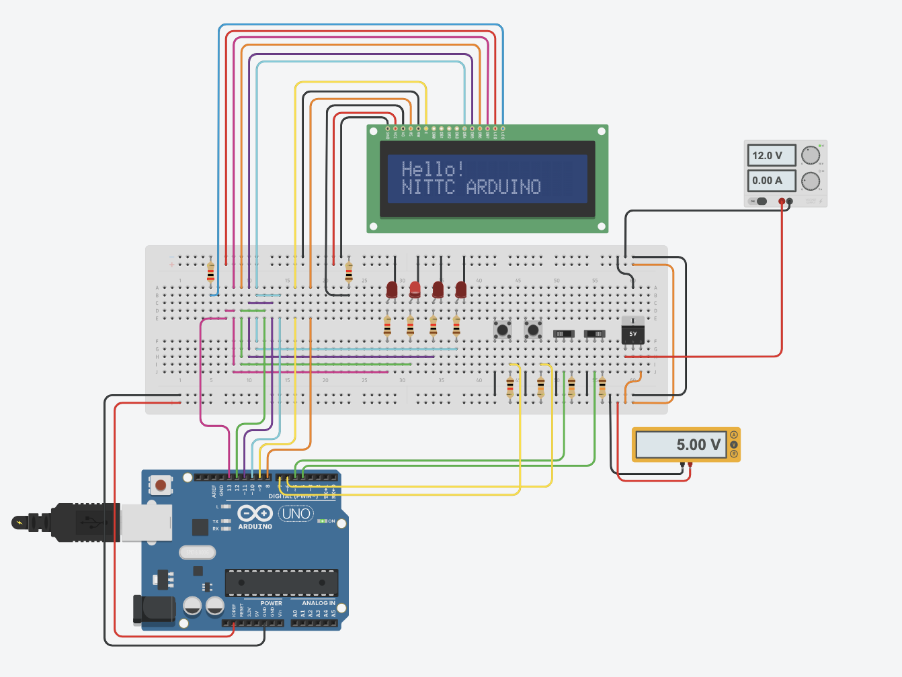
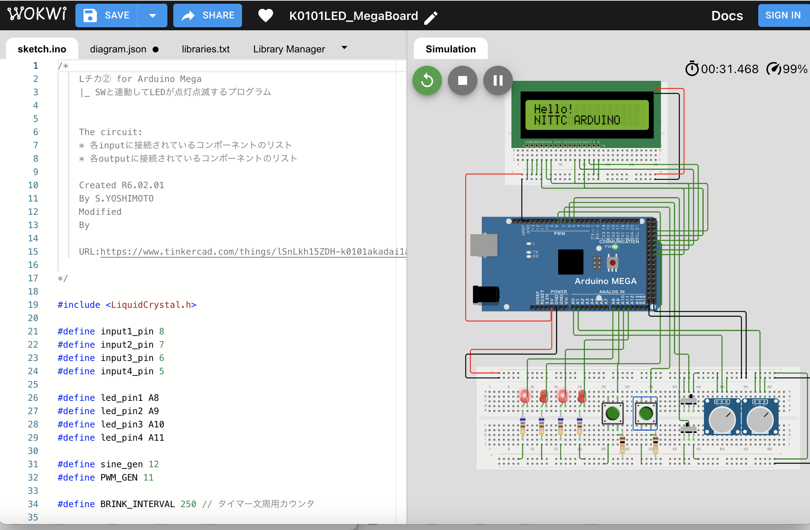
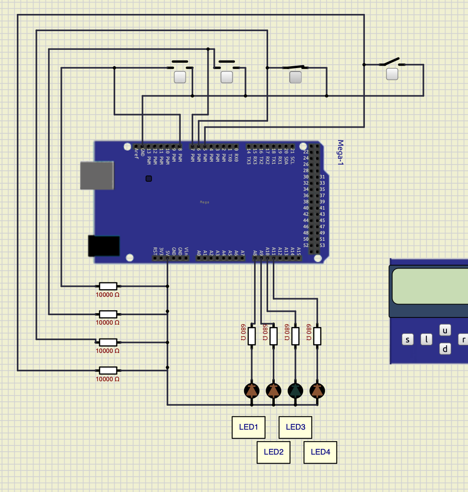

# LED点灯プログラム

## 概要
* arduinoを用いてLEDの点灯を行うプログラムを作成する。Arduinoでのプログラミング方法やマイコンを用いたLED点灯回路の設計概要を学ぶ。

## シミュレーション
* 回路図（ブレッドボード配線）例



## メモ
* プログラム

オンボードのLEDを1秒ごとにLチカする．

```LEDBlink.ino
/*
    Lチカ for Arduino UNO
    |_ BuiltinのLEDの点滅プログラム


    The circuit:
    * 各inputに接続されているコンポーネントのリスト
    * 各outputに接続されているコンポーネントのリスト

    Created R6.02.01
    By S.YOSHIMOTO
    Modified 
    By 

    URL:https://www.tinkercad.com/things/lSnLkh15ZDH-k0101akadai1arduino

*/

#include <LiquidCrystal.h>

#define input1_pin 7
#define input2_pin 6
#define input3_pin 5
#define input4_pin 4

#define led_pin1 10
#define led_pin2 11
#define led_pin3 12
#define led_pin4 13

#define BRINK_INTERVAL 250 // タイマー文周用カウンタ

LiquidCrystal lcd(8, 9, 10, 11, 12, 13);

const int INPUT_PIN = A0;    // 入力ピンをA0に固定
int VOLUME;                  // 変数を整数型で宣言
unsigned long v_data;
unsigned int Timer1_tick;  // Timer1の割り込み回数を数える変数

void setup(){
  pinMode(input1_pin,INPUT) ;
  pinMode(input2_pin,INPUT) ; 
  pinMode(input3_pin,INPUT) ;
  pinMode(input4_pin,INPUT) ;
  
  pinMode(led_pin1,OUTPUT) ;
  pinMode(led_pin2,OUTPUT) ;
  pinMode(led_pin3,OUTPUT) ;
  pinMode(led_pin4,OUTPUT) ;  
  
  Serial.begin(115200);

  TCCR1A  = 0;
  TCCR1B  = 0;
  TCCR1B |= (1 << WGM12) | (1 << CS12);  //CTCmode //prescaler to 1
  OCR1A   = 255;
  TIMSK1 |= (1 << OCIE1A);  
  
  lcd.begin(16, 2);          // LCDの桁数と行数を指定する(16桁2行)
  lcd.clear();               // LCD画面をクリア
  lcd.setCursor(0, 0);       // カーソルの位置を指定
  lcd.print("Hello!");       // 文字の表示
  lcd.setCursor(0, 1);       // カーソルの位置を指定
  lcd.print("NITTC ARDUINO");  // 文字の表示

}

ISR (TIMER1_COMPA_vect) {

  /*
  タイマー1によるタイマー割り込み処理
  */

}


void loop(){
  int status1, status2, status3, status4 ;
  status1 = digitalRead(input1_pin) ; //スイッチの状態を読む
  status2 = digitalRead(input2_pin) ; //スイッチの状態を読む
  status3 = digitalRead(input3_pin) ; //スイッチの状態を読む
  status4 = digitalRead(input4_pin) ; //スイッチの状態を読む

  digitalWrite(LED_BUILTIN, HIGH);
  delay(1000); // Wait for 1000 millisecond(s)
  digitalWrite(LED_BUILTIN, LOW);
  delay(1000); // Wait for 1000 millisecond(s)
  
}


```

トグルスイッチとタクトスイッチに連動して４つのLEDを点灯・消灯させる

``` k0101_LED.ino

/*
    Lチカ② for Arduino UNO
    |_ BuiltinのLEDの点滅プログラム


    The circuit:
    * 各inputに接続されているコンポーネントのリスト
    * 各outputに接続されているコンポーネントのリスト

    Created R6.02.01
    By S.YOSHIMOTO
    Modified 
    By 

    URL:

*/

#include <LiquidCrystal.h>

#define input1_pin 7
#define input2_pin 6
#define input3_pin 5
#define input4_pin 4

#define led_pin1 10
#define led_pin2 11
#define led_pin3 12
#define led_pin4 13

#define BRINK_INTERVAL 250 // タイマー文周用カウンタ

LiquidCrystal lcd(8, 9, 10, 11, 12, 13);

const int INPUT_PIN = A0;    // 入力ピンをA0に固定
int VOLUME;                  // 変数を整数型で宣言
unsigned long v_data;
unsigned int Timer1_tick;  // Timer1の割り込み回数を数える変数

void setup(){
  pinMode(input1_pin,INPUT) ;
  pinMode(input2_pin,INPUT) ; 
  pinMode(input3_pin,INPUT) ;
  pinMode(input4_pin,INPUT) ;
  
  pinMode(led_pin1,OUTPUT) ;
  pinMode(led_pin2,OUTPUT) ;
  pinMode(led_pin3,OUTPUT) ;
  pinMode(led_pin4,OUTPUT) ;  
  
  Serial.begin(9600);

  TCCR1A  = 0;
  TCCR1B  = 0;
  TCCR1B |= (1 << WGM12) | (1 << CS12);  //CTCmode //prescaler to 1
  OCR1A   = 255;
  TIMSK1 |= (1 << OCIE1A);  
  
  lcd.begin(16, 2);          // LCDの桁数と行数を指定する(16桁2行)
  lcd.clear();               // LCD画面をクリア
  lcd.setCursor(0, 0);       // カーソルの位置を指定
  lcd.print("Hello!");       // 文字の表示
  lcd.setCursor(0, 1);       // カーソルの位置を指定
  lcd.print("NITTC ARDUINO");  // 文字の表示

}

ISR (TIMER1_COMPA_vect) {

  /*
  タイマー1によるタイマー割り込み処理
  */

}


void loop(){
  int status1, status2, status3, status4 ;
  status1 = digitalRead(input1_pin) ; //スイッチの状態を読む
  status2 = digitalRead(input2_pin) ; //スイッチの状態を読む
  status3 = digitalRead(input3_pin) ; //スイッチの状態を読む
  status4 = digitalRead(input4_pin) ; //スイッチの状態を読む

  if(status1 == HIGH){
    digitalWrite(led_pin1,LOW) ;//点灯
  }else{
    digitalWrite(led_pin1,HIGH) ; //消す
  }

  if(status2 == HIGH){
    digitalWrite(led_pin2,LOW) ;//点灯
  }else{
    digitalWrite(led_pin2,HIGH) ; //消す
  }  

  if(status3 == HIGH){
    digitalWrite(led_pin3,LOW) ;//点灯
  }else{
    digitalWrite(led_pin3,HIGH) ; //消す
  }  
  
  if(status4 == HIGH){
    digitalWrite(led_pin4,LOW) ;//点灯
  }else{
    digitalWrite(led_pin4,HIGH) ; //消す
  }  
  
}

```

## シミュレーション for ArduinoMega

### wokwi
 

### SimuLIDE
 