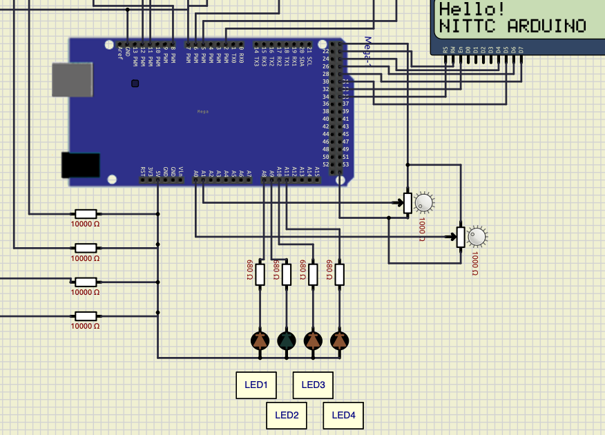
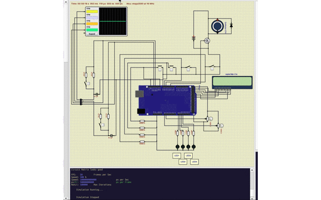

# 1秒周期LED点滅作成実験

## 概要
* 割り込みタイマーで1秒周期の割り込みを作成し２つのLEDを１秒周期で交互に点滅させる。

## メモ
* Timer1を使用。Timer1は16bitタイマーなので1周期は65536カウント。（16Mhzクロックなので、1割り込み周期4msくらい）
* Timer1のタイマーカウントを256カウントに変更して、分周を256を使用。（32分周がないため）
* 4.096ms割り込み周期となるため、1秒は250回（BRINK_INTERVAL)としている。

## シミュレーション for ArduinoMega

### wokwi
 

### SimuLIDE
 

 
