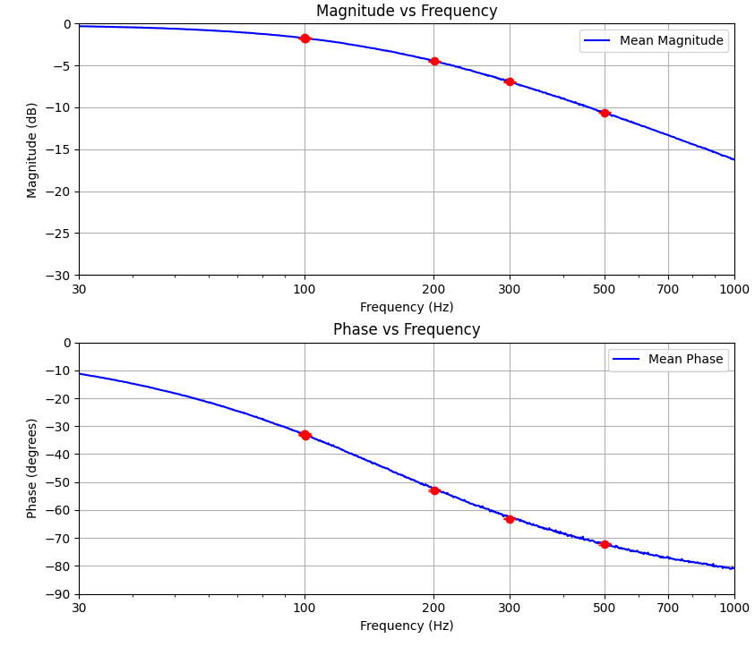
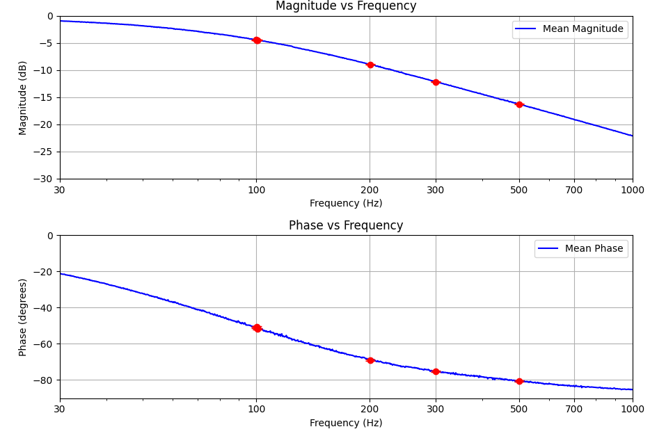

# 新実験メモ
## 新基板CR回路特性測定

18枚の素子を実装した基板を測定し各ボードのゲインと位相特性の平均値を測定

### 11kΩ - 0.1μF

### 22kΩ - 0.1μF

## 各ボード別周波数特性

Googleサービスに依存します．

* [ボード1]( https://script.google.com/a/macros/g.wakayama-u.jp/s/AKfycbx-WI2bokxPt4A5Z1jBbni5ThQErjU_1JcalyUz8Kp5MWb3HMENsxIAMcDBrL7higs/exec )
    
* [ボード2](https://script.google.com/a/macros/g.wakayama-u.jp/s/AKfycbz86AZevWZub6cTjWfmV1H2gnhtUvQrhQD_dgSvPTK_QJjtATiGE3riVfh60bZSiGBP/exec)
    

* [ボード3](https://script.google.com/a/macros/g.wakayama-u.jp/s/AKfycbwj8764h8xbpJZ4vTIckRXiMOqVDo0VSQRf8wenTKjR4kjwTChB_1xqRcitIQVFb297/exec)
    

* [ボード4](https://script.google.com/a/macros/g.wakayama-u.jp/s/AKfycbw3JfUdAbpbCZMuZ80-mhZWR2lJo31JOYqZe1ZRdFU5jnljPwCW0-q4yz1PZh2HlSX4eg/exec)
    

* [ボード5](https://script.google.com/a/macros/g.wakayama-u.jp/s/AKfycbw3N99BkLnaQIGckZZe3vMBxy2CVR9FRpjzHswGGnSuHJgKWFHkwUQU1rgEd4nWwYmBLg/exec)
    

* [ボード6](https://script.google.com/a/macros/g.wakayama-u.jp/s/AKfycbzLQq-e-gORy6tFFjhd-r_q1xlNBIsspqUU4P66fjzrDVK45UUkZp1fv3zEOLX17Jj7/exec)

* [ボード7](https://script.google.com/a/macros/g.wakayama-u.jp/s/AKfycbyoquysJyEztDnc7ai63H_UwrXi_Ek9OlmfYMuOFOketNDuDK0oOBvdHphrKf1i9588/exec)
    

* [ボード8](https://script.google.com/a/macros/g.wakayama-u.jp/s/AKfycbyRcifg0jeqW-07V12eCd0ybYfny9M3kalIqPlFsq4W-5s0U0lxrPjenDuv4KR_RGerLA/exec)
    

* [ボード9](https://script.google.com/a/macros/g.wakayama-u.jp/s/AKfycbx98ILTrzVhXBsP0csoGcJHn5_MYqWLiN8tnYTdlErhCvoV-ThM4qJjmDfm9yOsyYYiuA/exec)
    

* [ボード10](https://script.google.com/a/macros/g.wakayama-u.jp/s/AKfycbw6Px_JUt1H8CF_fvcde7PeMnebCYYBB3Qorde6UGV6ujjjCdFwcdsPckk-FFnA6cCp/exec)
    

* [ボード11](https://script.google.com/a/macros/g.wakayama-u.jp/s/AKfycbz_jIOP7_PZyoN_IxM4Y9d1CFCeXTUslAHpJSFycp2q8R0hGe7PfypkFSSrPOnTdOHS/exec)
    

* [ボード12](https://script.google.com/a/macros/g.wakayama-u.jp/s/AKfycbxJe_yxVdC4NQ21kpZJkz7tJrLhuPysuod4Fr7653DbOC6CxkIXxu2DmBnshRJo6TZP/exec)
    

* [ボード13](https://script.google.com/a/macros/g.wakayama-u.jp/s/AKfycbzhWIb7ZH3I8qUgIwR3w2OcJDCv7__AV65EXEvjrKW534kO8C333z-NXzy3Zp1Yvy0i-A/exec)
    

* [ボード14](https://script.google.com/a/macros/g.wakayama-u.jp/s/AKfycbyFy4SO3jXfkFIeJBKi7wLy-whKWw_6j9m8FzNGOYQzE4jq4-qwkuZ7TOwwXbj4574/exec)
    

* [ボード15](https://script.google.com/a/macros/g.wakayama-u.jp/s/AKfycbyzq-MN--gL4LC0G9SPQzJsMvV910zWun5vHEZjikKeqAEFuJYfA84PNFVIJZzKI_8iyA/exec)
    

* [ボード16](https://script.google.com/a/macros/g.wakayama-u.jp/s/AKfycbx1diYDaORkdlxvW522MsS0rHilQ2D8BUqT_4HYeBdiu85P1dCFzIrh4kg6udfCK9L8PA/exec)
    

* [ボード17](https://script.google.com/a/macros/g.wakayama-u.jp/s/AKfycbzOTH616Z455sxREVNCVSsfKkYS6PdIulN_BQYjbZEvjYrKEA99ZHmzWsVaN5Z6lw0V/exec)
    

* [ボード18](https://script.google.com/a/macros/g.wakayama-u.jp/s/AKfycbxrowuWioU4j0fIKDZTWi3RY-tDHhEn6x-Xwu95qwxAKr27SKycmvyLds3hlfUYUQpsZw/exec)

* ボード19

    未実装

* ボード20

    未実装