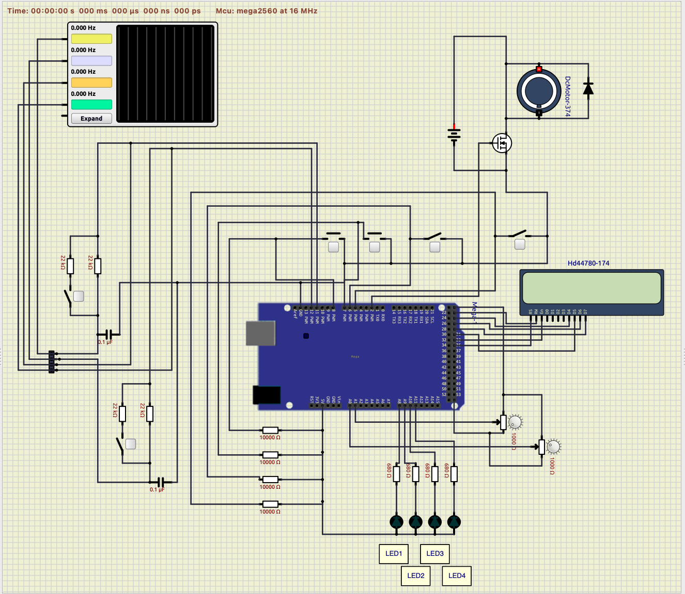

# 課題1

## 概要
第１回、第２回実験の課題

* LED点灯プログラム
* SWによるLED点灯プログラム
* LCDディスプレイのプログラミング
* 2bitによる10進数表現
* 1秒周期LED点滅作成実験

## シミュレーション

* シミュレーションソフトは以下．

    [wowki](https://wokwi.com/)

    * 4E実験ボードを想定した回路

        

    [SimuLIDE](https://simulide.com/p/)

    * 4E実験ボードを想定した回路
    
        