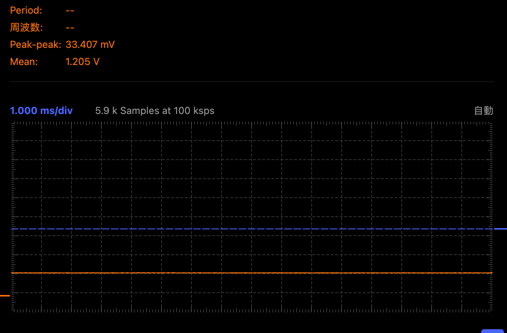
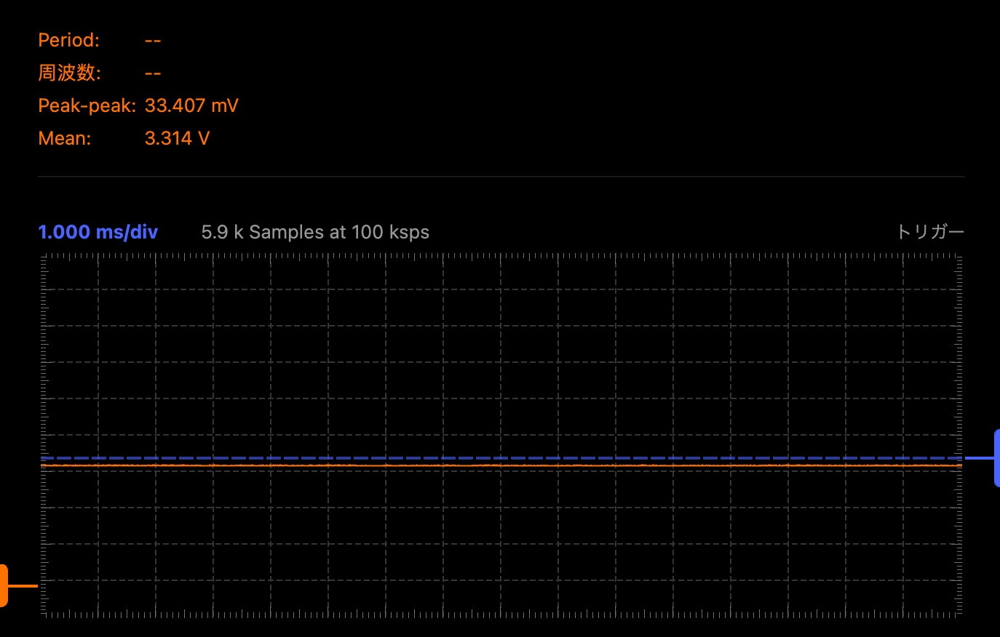
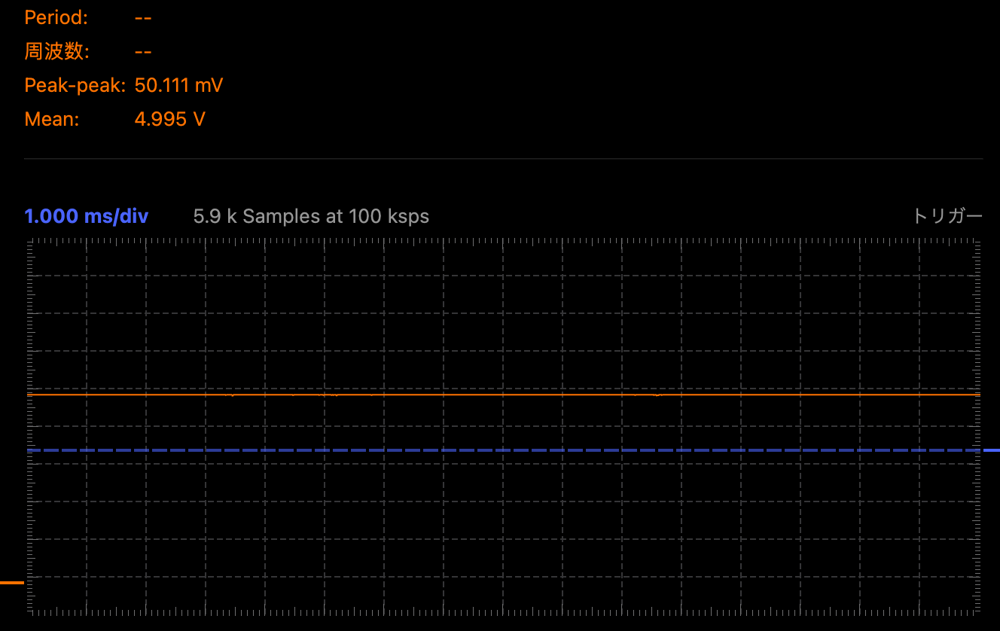
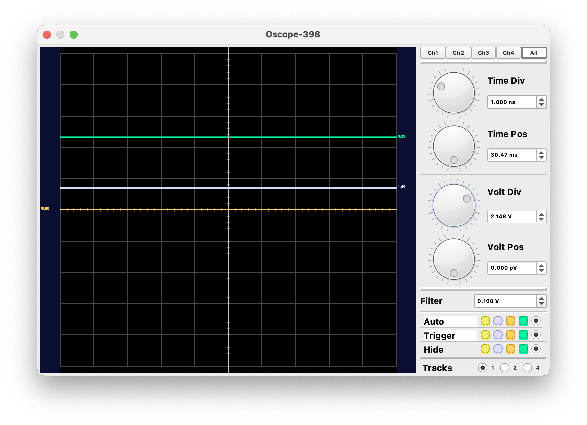
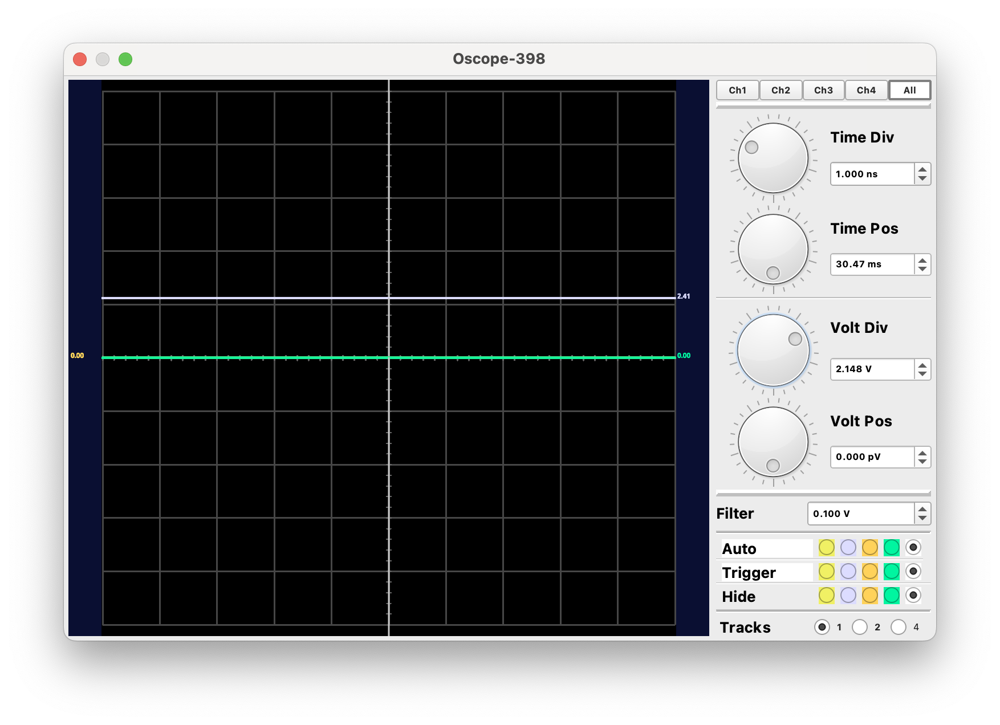
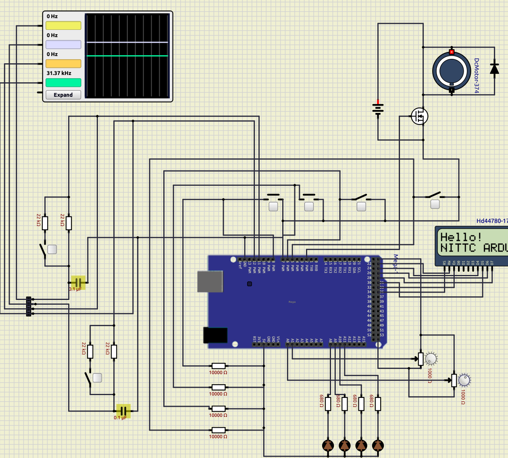
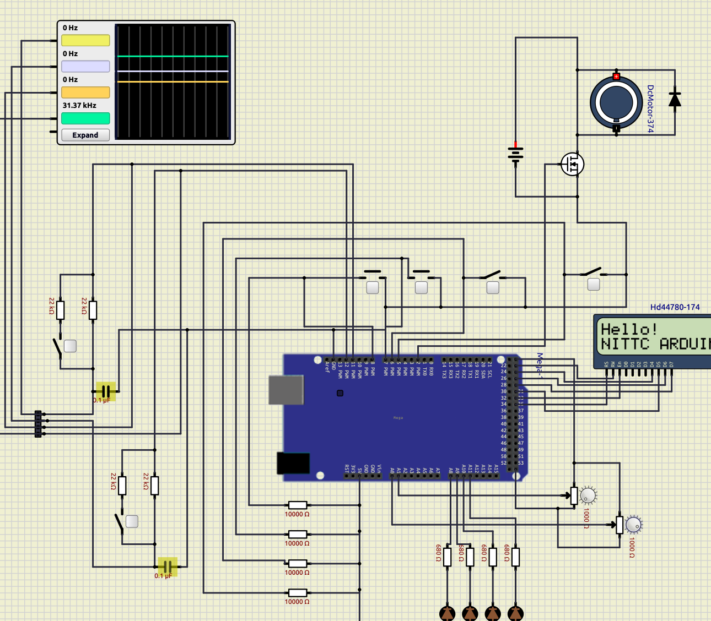

# PWMによるモーター駆動

## 概要
* AD変換で可変抵抗から0~1024の離散値を取得。その値に応じてPWMのデューティ比を変更、モーターを駆動して速度が変わることを確認する。

## メモ
* AD変換値は1024段階で取得できるが、PWM(analogWrite関数)は256段階となるので、AD値を4で割り算した値をPWMのデューティ比に引数として渡している。
* PWMは高速PWMモードとしておくこと。(PWM周波数62.5kHz)

## PWMデューティ比の確認
* モーター出力に指定しているポート（2)をRCローパスフィルタの接続されているポート(12)を指定し波形を観測。

* PWMによる直流波形
 

 

  

## シミュレーション for ArduinoMega

### wokwi
 未検証．

### SimuLIDE
 

 

 

 

 

