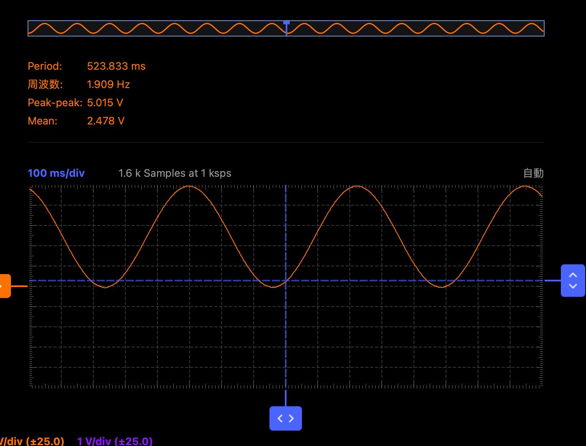
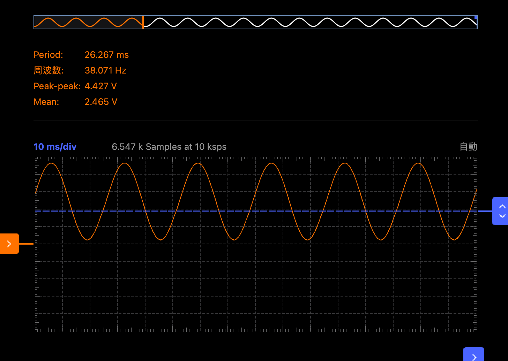
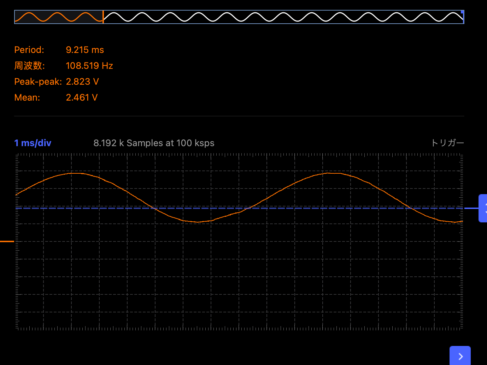
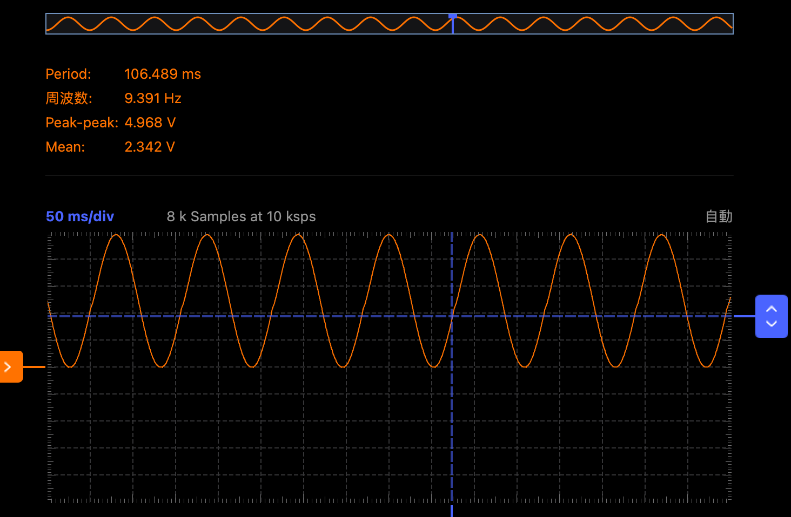
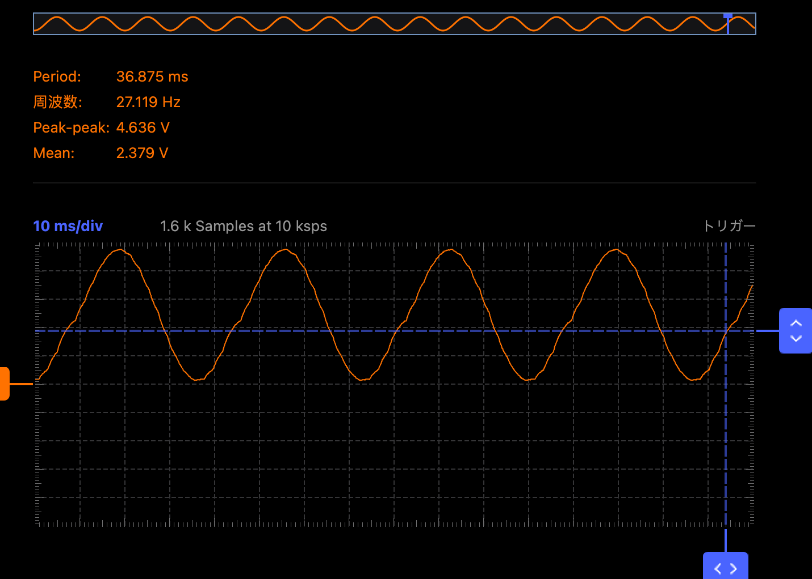
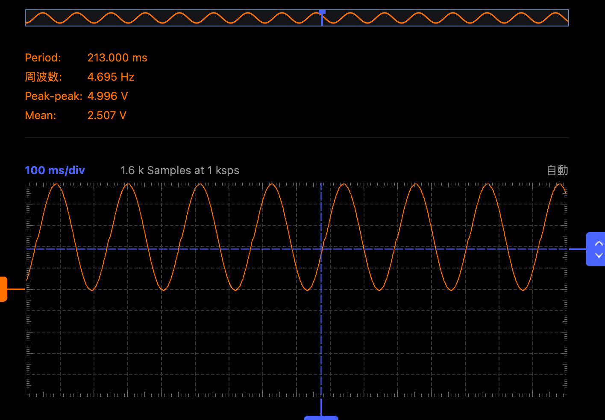
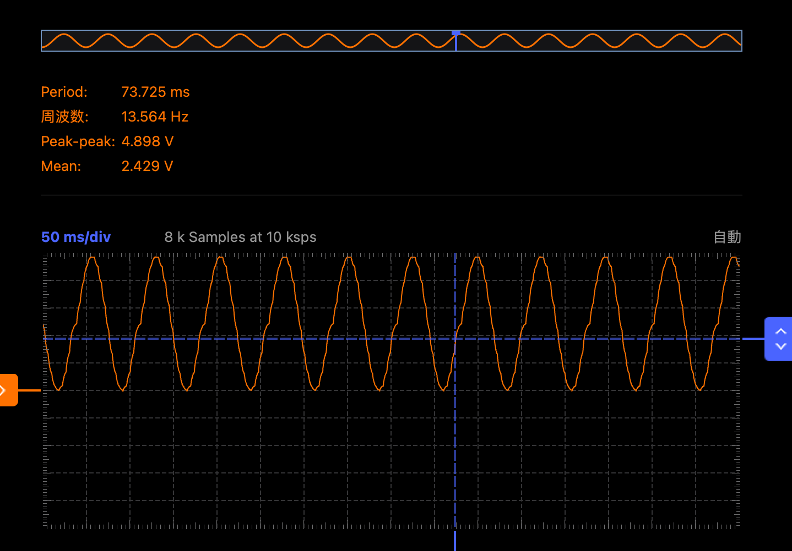

# 正弦波発生の特性実験

## 概要
* 離散化された正弦波テーブルから値を取得して設定された割り込み周期に応じてPWM値を出力する。
* 出力されたPWM値をRCローパスフィルタに通して滑らかな正弦波を観測でき正弦波のサンプル間隔と割り込み周期を変更することで理論値通りの周波数の正弦波を観測できることを確認する。

## メモ
* 正弦波のテーブルは1024点をarduino組み込みsin関数から作成
* 割り込み周期は
  * 0.512ms(OCR5A=8191)
  * 2.048ms(OCR5A=32767)
  * 4.096ms(OCR5A=65535)

  をコメントアウトで選択できるように記載。

  割り込み周期の決定は、タイマーレジスタのカウンタ数を変更して対応
  （カウンタ数の最大は16bit=65536）

## 実験1：0.512ms割り込み周期の正弦波測定

* ステップ数 1：D値 < 8
   理論値　1024 / 1 = 1024 → 1 / (1024 * 0.512ms) =  1.9[Hz]

   

* ステップ数 20 ： 160 < D値 < 167 
   理論値　1024 / 20 = 52 → 1 / (52 * 0.512ms) =  38[Hz]

   

* ステップ数 60 ： 480 < D値 < 487

   理論値　1024 / 60 = 17 → 1 / (17 * 0.512ms) =  125[Hz]

   

## 実験2：2種類の割り込み周期の正弦波測定
* 割り込み周期:2.048ms
  * ステップ数 20 ： 160 < D値 < 167 

     理論値　1024 / 20 = 52 → 1 / (52 * 2.048ms) =  9[Hz]
 
     

  * ステップ数 60 ： 480 < D値 < 487

     理論値　1024 / 60 = 17 → 1 / (17 * 2.048ms) =  28[Hz]

     

* 割り込み周期:4.096ms
  * ステップ数 20 ： 160 < D値 < 167 

     理論値　1024 / 20 = 52 → 1 / (52 * 4.096ms) =  4.7[Hz]

     

  * ステップ数 60 ： 480 < D値 < 487

     理論値　1024 / 60 = 17 → 1 / (17 * 4.096ms) =  14[Hz]     

     