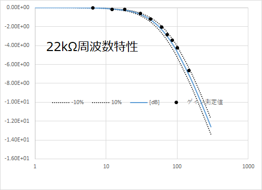
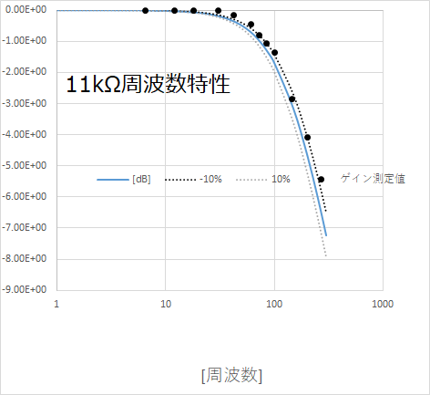
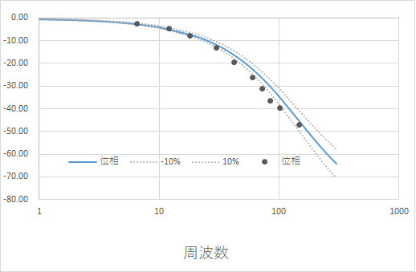
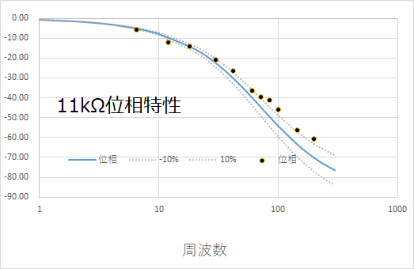
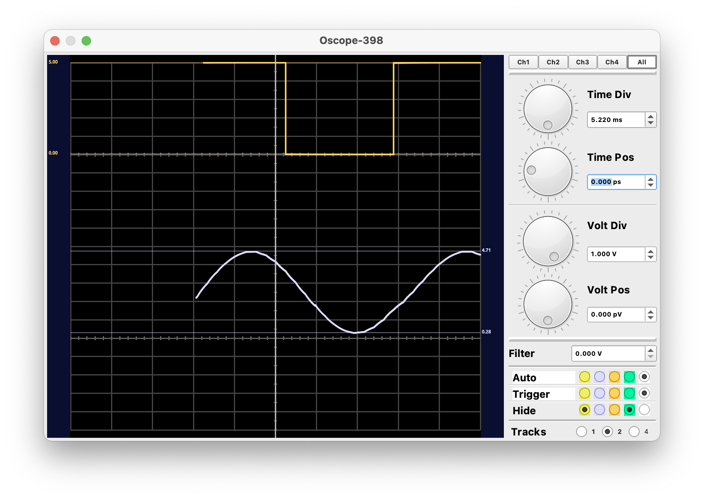
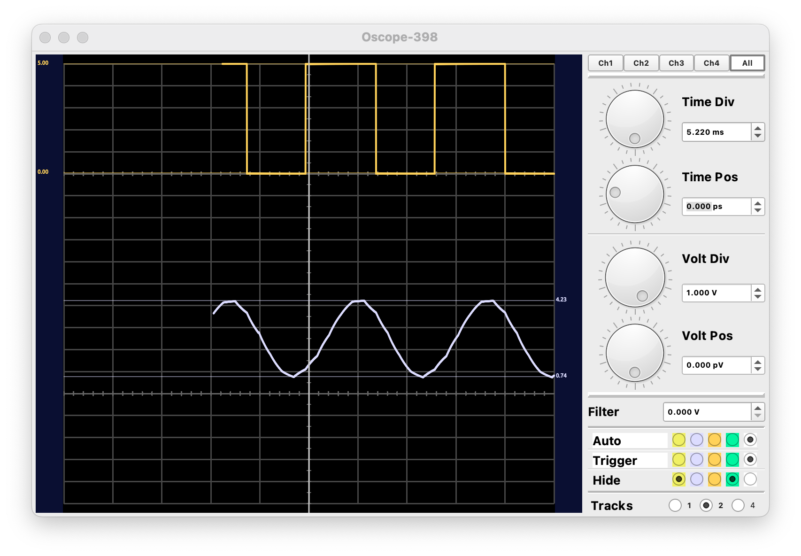
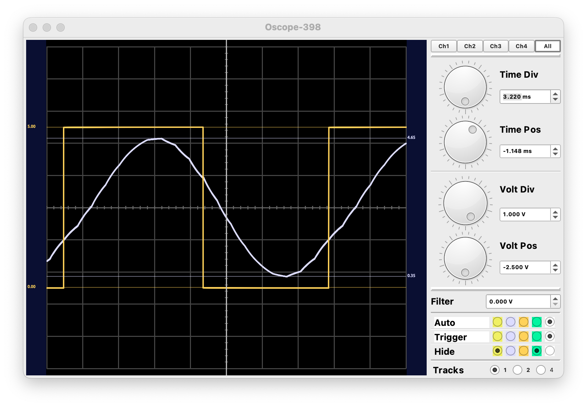
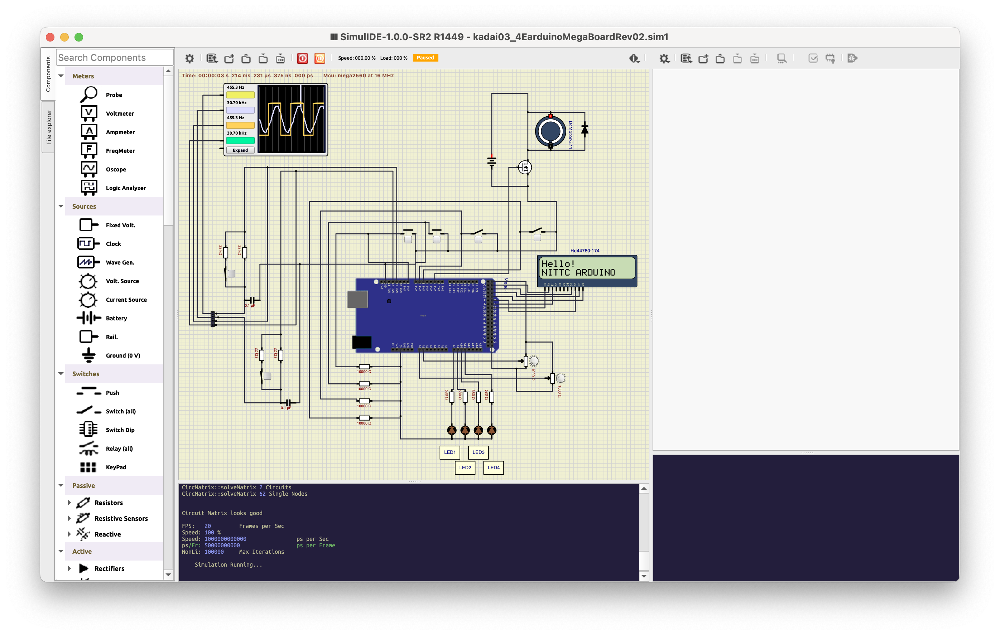

# CRローパスフィルタ特性測定実験

## 概要
* 11kΩと22kΩの抵抗(R)と0.1uのコンデンサで作成したRCフィルタ回路で正弦波を観測し平滑化された正弦波の周波数特性、位相特性を調べる。

## メモ
* 割り込み周期は、0.000625msで測定

## 特性測定例
* 周波数特性
 
 

* 位相特性
 
 
 ※かなり怪しいので要検証

## シミュレーション for ArduinoMega

### wokwi
 未検証．

### SimuLIDE
 

 

 

 

 

