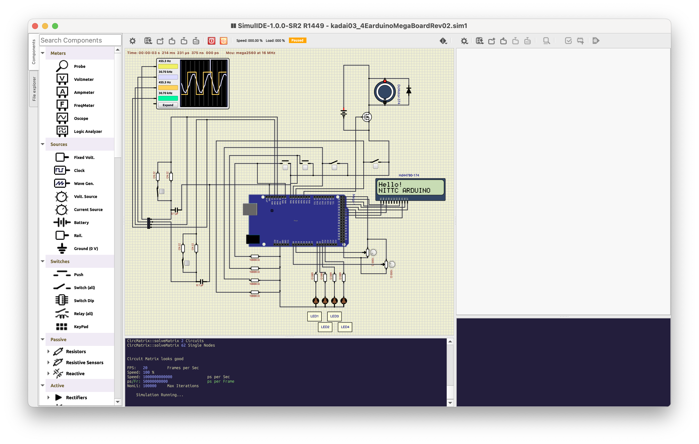

# CRローパスフィルタ特性測定実験

## 概要
* 11kΩと22kΩの抵抗(R)と0.1uのコンデンサで作成したRCフィルタ回路で正弦波を観測し平滑化された正弦波の周波数特性、位相特性を調べる。

## メモ
* 割り込み周期は、0.000625msで測定

## 特性測定例
* 周波数特性
 
 

* 位相特性
 
 
 ※かなり怪しいので要検証


 * ソースコード
 ```
/*
    アナログフィルタ特性測定実験 for Arduino Mega
    ┗ Timer5の比較一致割り込みを設定してAD変換を開始させる
    ┗ Timer5の割り込み間隔でAD変換割り込みを発生させる
    ┗ Timer1に対応するピンでPWM波形を発生させる

    The circuit:
    * 各inputに接続されているコンポーネントのリスト
    * 各outputLEDに接続されているコンポーネントのリスト

    Created R6.03.10
    By 
    Modified 
    By 

    URL:

*/
#include <LiquidCrystal.h>

const int nWave = 1024;
const int stepDiv = 8;

const int input1Pin = 8;
const int input2Pin = 7;
const int input3Pin = 6;
const int input4Pin = 5;

const int led1Pin = A8;
const int led2Pin = A9;
const int led3Pin = A10;
const int led4Pin = A11;

const int inputPin = A0;    // 入力ピンをA0に固定

unsigned long VOLUME;                  // 変数を整数型で宣言
unsigned int step;
unsigned int wave[nWave];

volatile unsigned int i_wave;
volatile float unitDeg = (2.0 * 3.141592) / nWave;
volatile float frq;
volatile bool adcReady = false; // AD変換完了フラグ

LiquidCrystal lcd(35, 23, 33, 25, 31, 27, 29);


// AD変換完了割り込みハンドラ
// AD変換結果の処理（ここにコードを追加）
ISR(ADC_vect) {
  adcReady = true; // フラグをセット

  unsigned int w;
  int status1, status2, status3, status4 ;

  if (i_wave >= nWave){
  	i_wave = 0;
  } 

  w = wave[i_wave]; 

  OCR1A = w;

  i_wave = i_wave + step;

  status1 = digitalRead(input1Pin) ; //スイッチの状態を読む
  status2 = digitalRead(input2Pin) ; //スイッチの状態を読む
  status3 = digitalRead(input3Pin) ; //スイッチの状態を読む
  status4 = digitalRead(input4Pin) ; //スイッチの状態を読む

  VOLUME = analogRead(inputPin);  // アナログ値の読み取り

  step = VOLUME / (float) stepDiv;
  if(step < 1){
    step = 1;
  } else if(step >  127){
    step = 127;
  }

  frq = (1.0/(0.0625e-6*2048*1024)*step);

  lcd.begin(16, 2);          // LCDの桁数と行数を指定する(16桁2行)
  lcd.clear();               // LCD画面をクリア
  lcd.setCursor(0, 0);       // カーソルの位置を指定
  lcd.print("step");       // 文字の表示
  lcd.setCursor(10, 0);
  lcd.print(step); 
  lcd.setCursor(0, 1);       // カーソルの位置を指定
  lcd.print("frequency");  // 文字の表示
  lcd.setCursor(10, 1);
  lcd.print(frq); 
  lcd.setCursor(14, 1);
  lcd.print("Hz");

  Serial.println(VOLUME);
  Serial.println(step);
}

void setup() {
int i;
  i_wave = 0;
  step = 0;
  unitDeg = 0;

  pinMode(inputPin, INPUT);
  pinMode(input1Pin,INPUT) ;
  pinMode(input2Pin,INPUT) ; 
  pinMode(input3Pin,INPUT) ;
  pinMode(input4Pin,INPUT) ;
  
  pinMode(led1Pin,OUTPUT) ;
  pinMode(led2Pin,OUTPUT) ;
  pinMode(led3Pin,OUTPUT) ;
  pinMode(led4Pin,OUTPUT) ;
  
  Serial.begin(9600);

  // AD変換の設定
  ADMUX = 0; // ADC0を選択、参照電圧はAVcc
  ADCSRA = (1 << ADEN) | (1 << ADIE) | (1 << ADPS2) | (1 << ADPS1) | (1 << ADPS0); // AD変換を有効化、割り込みを有効化、プリスケーラを設定

  // Timer5の設定
  TCCR5A  = 0;
  TCCR5B  = 0;
  TCCR5B |= (1 << WGM52) | (1 << CS50);  //CTCmode //prescaler to 1
//  TCCR5B |= (1 << WGM52) | (1 << CS51);  //CTCmode //prescaler to 8
//  TCCR5B |= (1 << WGM52) | (1 << CS50)| (1 << CS51) ;  //CTCmode //prescaler to 64
//  OCR5A   = 65535;  // 4.096ms割り込み周期
//  OCR5A   = 32767; // 2.048ms割り込み周期
//  OCR5A   = 8191; // 0.512ms割り込み周期
    OCR5A   = 2047;  // 0.128ms割り込み周期
   TIMSK5 |= (1 << OCIE5A);

  // Timer1の設定
  // ピン11と12でPWM出力を有効化
  pinMode(11, OUTPUT);
  pinMode(12, OUTPUT);

  // Timer1を停止
  TCCR1A = 0; // Timer1のレジスタAを0に設定
  TCCR1B = 0; // Timer1のレジスタBを0に設定

  // フェーズと周波数の調整を設定 (mode 14)
  TCCR1B |= (1 << WGM13) | (1 << WGM12);
  TCCR1A |= (1 << WGM11);

  // クロック選択とプリスケーラの設定 (ここではプリスケーラを1に設定)
  TCCR1B |= (1 << CS10); 

  // ICR1にトップ値を設定 (PWM周波数を決定)
  ICR1 = 2047; // ここでPWMの周波数を設定


// PWMのデューティサイクルを設定
  // OCR1A (ピン11のデューティサイクル)
//  OCR1A = 1024; // デューティサイクルを50%に設定

  // OCR1B (ピン12のデューティサイクル、使用する場合)
  // OCR1B = 1024; // デューティサイクルを50%に設定 (必要に応じて変更)

  // ノンインバーティングモードでPWMを有効化
  TCCR1A |= (1 << COM1A1);
  // TCCR1A |= (1 << COM1B1); // ピン12を使用する場合はコメントを外す

  step = 1;
  unitDeg = (2.0 * 3.141592) / nWave;
  for (i = 0; i < nWave; i++)
  {
    wave[i] = (unsigned int)((((sin(unitDeg * (float) i )+ 1.0)/ 2.0 )* 2047.0 ) + 0.5);
  }
}

// Timer5の比較一致割り込みハンドラ
ISR(TIMER5_COMPA_vect) {
  ADCSRA |= (1 << ADSC); // AD変換を開始
}

void loop() {
  if (adcReady) {
    adcReady = false;
    // 必要な処理をここに追加
  }
}


 ```

## シミュレーション for ArduinoMega

### wokwi
 未検証．

### SimuLIDE
 

 

 

 

 

