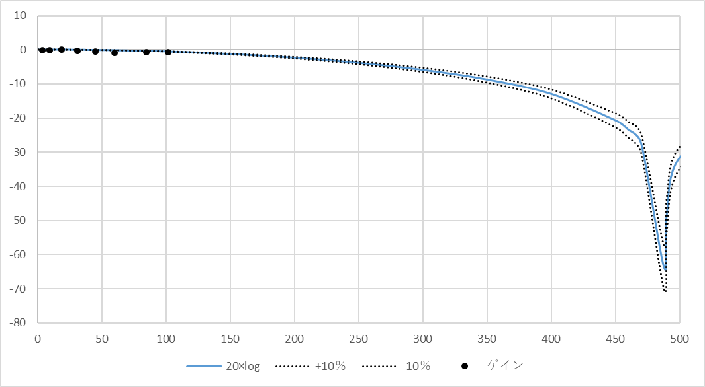
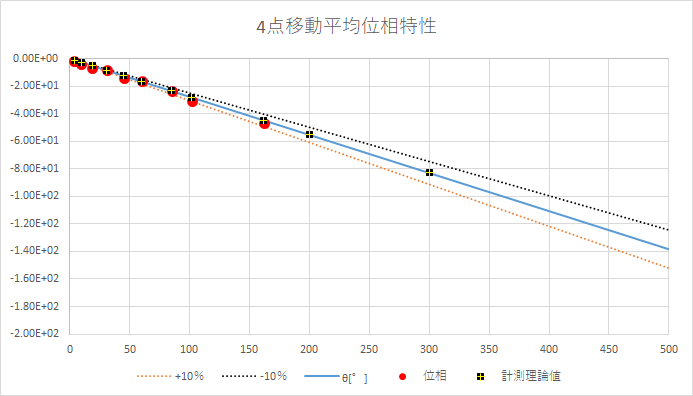
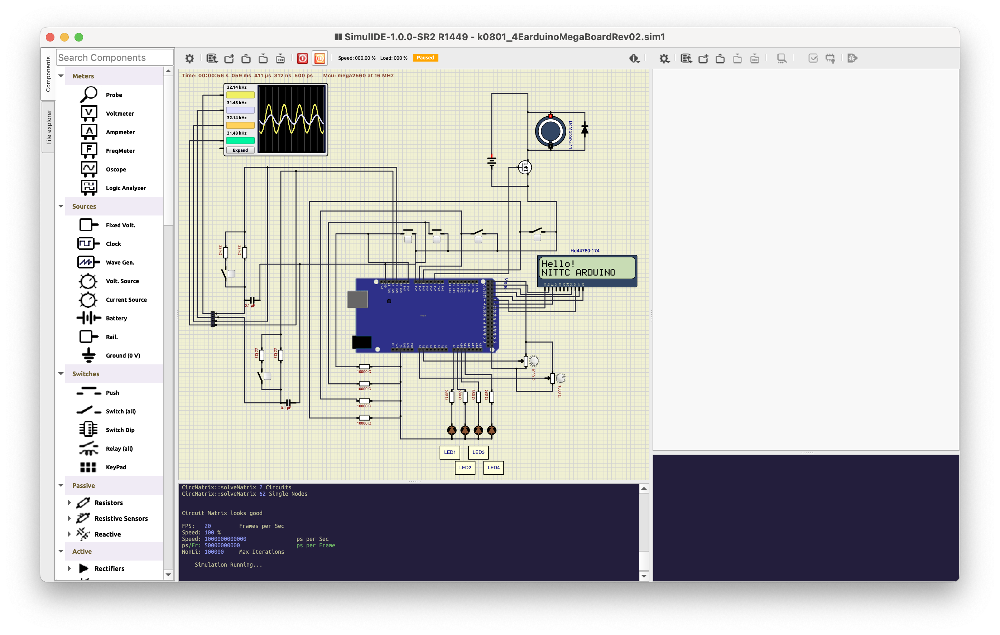

# 移動平均デジタルローパスフィルタ特性測定実験

## 概要
* 4点移動平均と8点移動平均のデジタルフィルタを実装し、
各移動平均ごとの周波数特性、位相特性を調べる。

## メモ
* 割り込み周期は、0.512msで測定

## 特性測定例
* 4点移動平均

※特に位相特性が理論値通りでないので8点平均までは実施せず。プログラム中にはコメントアウトで実装している。

 ** 周波数特性

 

 ** 位相特性

 

 * ソースコード
 ```
/*
    デジタルフィルタ4点平均 for Arduino Mega
    └ 4点移動平均を行い正弦波を出力する．

    The circuit:
    * 各inputに接続されているコンポーネントのリスト
    * 各outputLEDに接続されているコンポーネントのリスト

    Created R6.03.10
    By 
    Modified 
    By 

    URL:

*/

#include <LiquidCrystal.h>

#define N_WAVE 1024
#define step_div 4

#define input1Pin 8
#define input2Pin 7
#define input3Pin 6
#define input4Pin 5

#define ledPin1 A8
#define ledPin2 A9
#define ledPin3 A10
#define ledPin4 A11

LiquidCrystal lcd(35, 23, 33, 25, 31, 27, 29);

const int inputPin = A0;    // 入力ピンをA0に固定
unsigned long VOLUME;                  // 変数を整数型で宣言
unsigned int step;

unsigned int wave[N_WAVE];

volatile unsigned int iWave;
volatile float unitDeg = (2.0 * 3.141592) / N_WAVE;

int ad_0;
int ad_1;
int ad_2;
int ad_3;
int ad_4;
int ad_5;
int ad_6;
int ad_7;
int ad_data;


void setup(){
  int i;
  iWave = 0;
  step = 0;
  unitDeg = 0;

  pinMode(inputPin, INPUT);
  pinMode(input1Pin,INPUT) ;
  pinMode(input2Pin,INPUT) ; 
  pinMode(input3Pin,INPUT) ;
  pinMode(input4Pin,INPUT) ;
  
  pinMode(ledPin1,OUTPUT) ;
  pinMode(ledPin2,OUTPUT) ;
  pinMode(ledPin3,OUTPUT) ;
  pinMode(ledPin4,OUTPUT) ;
  
  Serial.begin(115200);

  TCCR5A  = 0;
  TCCR5B  = 0;
  TCCR5B |= (1 << WGM52) | (1 << CS50);  //CTCmode //prescaler to 1
//  TCCR5B |= (1 << WGM52) | (1 << CS51);  //CTCmode //prescaler to 8
//  TCCR5B |= (1 << WGM52) | (1 << CS50)| (1 << CS51) ;  //CTCmode //prescaler to 64
//  OCR5A   = 65535;  // 4.096ms割り込み周期
//  OCR5A   = 32767; // 2.048ms割り込み周期
  OCR5A   = 8191; // 0.512ms割り込み周期
//    OCR5A   = 2047;  // 0.128ms割り込み周期
   TIMSK5 |= (1 << OCIE5A);
  
  // Timer1の設定
  // ピン11と12でPWM出力を有効化
  pinMode(11, OUTPUT);
  pinMode(12, OUTPUT);

  // Timer1を停止
  TCCR1A = 0; // Timer1のレジスタAを0に設定
  TCCR1B = 0; // Timer1のレジスタBを0に設定

  // フェーズと周波数の調整を設定 (mode 14)
  TCCR1B |= (1 << WGM13) | (1 << WGM12);
  TCCR1A |= (1 << WGM11);

  // クロック選択とプリスケーラの設定 (ここではプリスケーラを1に設定)
  TCCR1B |= (1 << CS10); 

  // ICR1にトップ値を設定 (PWM周波数を決定)
  ICR1 = 2047; // ここでPWMの周波数を設定


// PWMのデューティサイクルを設定
  // OCR1A (ピン11のデューティサイクル)
//  OCR1A = 1024; // デューティサイクルを50%に設定

  // OCR1B (ピン12のデューティサイクル、使用する場合)
  // OCR1B = 1024; // デューティサイクルを50%に設定 (必要に応じて変更)

  // ノンインバーティングモードでPWMを有効化
  TCCR1A |= (1 << COM1A1);
  TCCR1A |= (1 << COM1B1); // ピン12を使用する場合はコメントを外す

  step = 1;
  unitDeg = (2.0 * 3.141592) / N_WAVE;
  for (i = 0; i < N_WAVE; i++)
  {
    wave[i] = (unsigned int)((((sin(unitDeg * (float) i )+ 1.0)/ 2.0 )* 2047.0 ) + 0.5);
  }

  lcd.begin(16, 2);          // LCDの桁数と行数を指定する(16桁2行)

}

ISR (TIMER5_COMPA_vect) {

  unsigned int w;

  if (iWave >= N_WAVE){
  	iWave = 0;
  } 

  w = wave[iWave]; 

  ad_7 = ad_6;
  ad_6 = ad_5;
  ad_5 = ad_4;
  ad_4 = ad_3;
  ad_3 = ad_2;
  ad_2 = ad_1;
  ad_1 = ad_0;
  ad_0 = w;

  ad_data = (ad_0 + ad_1 + ad_2 + ad_3 ) >>2;

  OCR1A = w;
  OCR1B = ad_data;


//  OCR1A = 1023;

  iWave = iWave + step;

  VOLUME = analogRead(inputPin);  // アナログ値の読み取り
    step = VOLUME / step_div;
  if(step < 1){
    step = 1;
  } else if(step >  255){
    step = 255;
  }

  #define frq (1.0/(0.512e-3*1024)*step)
}


void loop(){

  lcd.clear();               // LCD画面をクリア
  lcd.setCursor(0, 0);       // カーソルの位置を指定
  lcd.print("step");       // 文字の表示
  lcd.setCursor(10, 0);
  lcd.print(step); 
  lcd.setCursor(0, 1);       // カーソルの位置を指定
  lcd.print("frequency");  // 文字の表示
  lcd.setCursor(10, 1);
  lcd.print(frq); 
  lcd.setCursor(14, 1);
  lcd.print("Hz");

  Serial.println(VOLUME);
  Serial.println(step);
  delay(100);  

}


 ```


 ## シミュレーション for ArduinoMega

### wokwi
 未検証．

### SimuLIDE
 


 