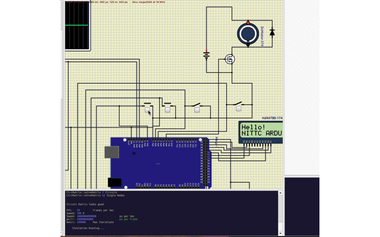

# モーターの発電特性

## 概要
* DCモーターの発電特性を測定する。

## メモ
 


 * ソースコード
 ```
/*
    入出力モーターによる発電測定 for Arduino Mega
    ┗ モーターを指定した値で駆動し、連動しているDCモーターから
    　AD変換で電圧値を取得する
    ┗ONOFF制御
      ┗しきい値を設けて閾値によって出力モーターの出力を調整する


    The circuit:
    * 各inputに接続されているコンポーネントのリスト
    * 各outputに接続されているコンポーネントのリスト

    Created R6.02.01
    By 
    Modified 
    By 

    URL:

*/
#include <LiquidCrystal.h>
LiquidCrystal lcd(35, 23, 33, 25, 31, 27, 29);

int mv;
int ad_data;
int ad_0;
int ad_1;
int ad_2;
int ad_3;
int ad_4;
int ad_5;
int ad_6;
int ad_7;

void setup() {
  pinMode(5,INPUT) ;
  pinMode(A2, INPUT);

   // ピン2を出力として設定
  pinMode(2, OUTPUT);
  // ピン11と12でPWM出力
  pinMode(11, OUTPUT);
  pinMode(12, OUTPUT);

  // Timer5の設定
  TCCR5A  = 0;
  TCCR5B  = 0;
  TCCR5B |= (1 << WGM52) | (1 << CS50);  //CTCmode //prescaler to 1//分周比1
  OCR5A   = 8000; // 0.5ms割り込み周期
  TIMSK5 |= (1 << OCIE5A); //タイマー5駆動開始

  // Timer1の設定
  // Timer1を停止
  TCCR1A = 0; // Timer1のレジスタAを0に設定
  TCCR1B = 0; // Timer1のレジスタBを0に設定

  // フェーズと周波数の調整を設定 (mode 14)
  TCCR1B |= (1 << WGM13) | (1 << WGM12);
  TCCR1A |= (1 << WGM11);

  // クロック選択とプリスケーラの設定 (ここではプリスケーラを1に設定)
  TCCR1B |= (1 << CS10); 

  // ICR1にトップ値を設定 (PWM周波数を決定)
  ICR1 = 1024; // ここでPWMの周波数を設定

  // ノンインバーティングモードでPWMを有効化
  TCCR1A |= (1 << COM1A1); // ピン11を使用
  TCCR1A |= (1 << COM1B1); // ピン12を使用


  // Timer3の設定
  TCCR3A = 0; // TCCR3Aレジスタを初期化
  TCCR3B = 0; // TCCR3Bレジスタを初期化
  TCNT3  = 0; // タイマーのカウンタ値を0にリセット

  // ノンインバーティングモードでPWMを設定（チャネルB）
  TCCR3A |= (1 << COM3B1);
  // ファストPWMモードを設定（ICR3をトップ値とする）
  TCCR3A |= (1 << WGM31);
  TCCR3B |= (1 << WGM32) | (1 << WGM33);
  
  // クロック選択とプリスケーラの設定（プリスケーラを1に設定）
   TCCR3B |= (1 << CS30);

  // PWMの周波数を設定するためのICR3の値を設定
  ICR3 = 1024; // 

 lcd.begin(16, 2);          // LCDの桁数と行数を指定する(16桁2行)
}


// Timer5の比較一致割り込み
ISR(TIMER5_COMPA_vect) {

  ad_7 = ad_6;
  ad_6 = ad_5;
  ad_5 = ad_4;
  ad_4 = ad_3;
  ad_3 = ad_2;
  ad_2 = ad_1;
  ad_1 = ad_0;
  ad_0 = analogRead(A2);

  ad_data = (ad_0 + ad_1 + ad_2 + ad_3 + ad_4 + ad_5 + ad_6 + ad_7) >>3;//平均化処理

  int statusSW ;
  statusSW = digitalRead(5) ; //スイッチS2の状態を読む

  if(statusSW==1){
    mv = 300;
  }else{
    mv = 800;
  }

  OCR1A = mv;
  OCR1B = ad_data;
  OCR3B = mv;
}

void loop() {

  lcd.clear();               // LCD画面をクリア
  lcd.setCursor(0, 0);       // カーソルの位置を指定
  lcd.print("mv");       // 文字の表示
  lcd.setCursor(0, 1);       // カーソルの位置を指定
  lcd.print("ad_data=");  // 文字の表示
  lcd.setCursor(10, 0);
  lcd.print(mv); 
  lcd.setCursor(10, 1);
  lcd.print(ad_data); 
  delay(100); 

}


 ```

 ## シミュレーション for ArduinoMega

### wokwi
 未検証．

### SimuLIDE
 

 