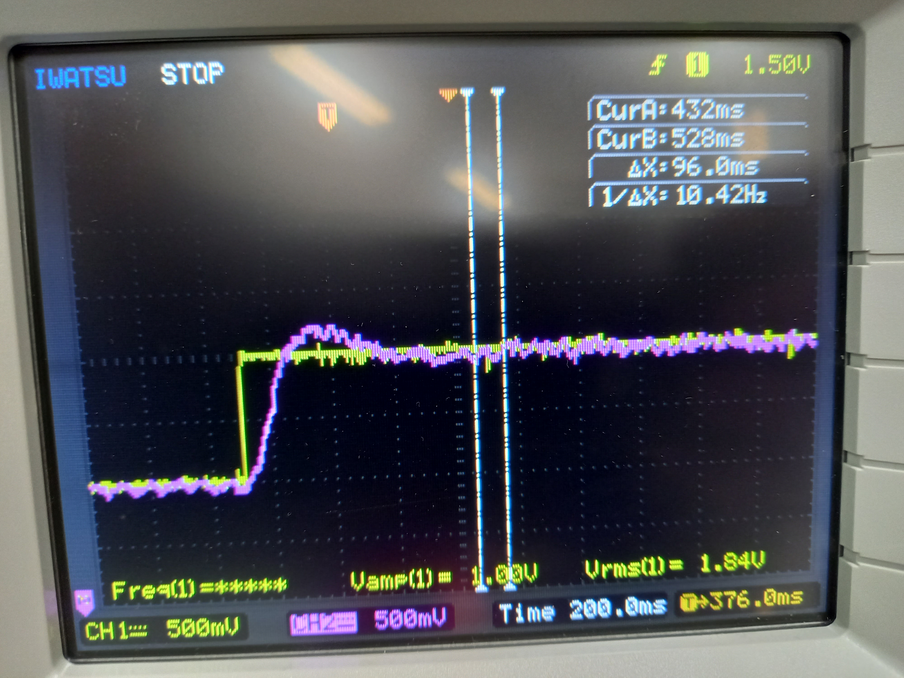

# PI制御実験

## 概要
* 比例制御と積分制御でモーターの目標値に近づくように発電用モーターの指令値を制御できることを確認する。

## メモ
* 制御の追従等は未検証。
* 理論値についても未検証。
* analogReadは1024段階、analogWriteは256段階の差異があるため、モーター発電入力値を受け取るanalogRead値やPI制御用の計算では1024段階の値で計算し、最終的に得られるモーター指令値は4で割り算した値(integer)をanalogWriteの指令値引数として渡している。

* PI制御の波形

    * Target :  200 or 400

    * D: 200前後、400前後
    * kp : 3、 ki : 13

    * 200 -> 400

         

* ソースコード

```K1003_PIControl.ino
/*
    モーターのPI制御測定
    |_ モーターの発電入力を測定し、測定結果に応じてモーター出力をPI制御する


    The circuit:
    * 各inputに接続されているコンポーネントのリスト
    * 各outputに接続されているコンポーネントのリスト

    Created R6.02.01
    By S.YOSHIMOTO
    Modified 
    By 

    URL:

*/
#include <LiquidCrystal.h>

#define input1_pin 8 //Tact01 
#define input2_pin 7 //Tact02
#define input3_pin 6 //Toggle01
#define input4_pin 5 //Toggle02

#define LED_D1 A8
#define LED_D2 A9
#define LED_D3 A10
#define LED_D4 A11
#define LED_D5 3

#define Motor_Input A2
#define Motor_PWM 2
#define TARGET_GEN 11
#define PWM_GEN 12

#define VON 200
#define VOFF 75

#define BRINK_INTERVAL 250 

// LCDディスプレイ設定
LiquidCrystal lcd(35, 23, 33, 25, 31, 27, 29);
unsigned int Timer5_tick;
const int INPUT_PIN = A0;    // 入力ピンをA0に固定
int VOLUME;                  // 変数を整数型で宣言

int chatt01, chatt02;

long mv;
long en;
int ki;
int kp;
long di;

void setup(){
  pinMode(input1_pin,INPUT) ;
  pinMode(input2_pin,INPUT) ; 
  pinMode(input3_pin,INPUT) ;
  pinMode(input4_pin,INPUT) ;
  
  pinMode(LED_D1,OUTPUT) ;
  pinMode(LED_D2,OUTPUT) ;
  pinMode(LED_D3,OUTPUT) ;
  pinMode(LED_D4,OUTPUT) ;

  pinMode(Motor_Input,INPUT) ;
  pinMode(Motor_PWM,OUTPUT) ;

//  Serial.begin(115200);
  Serial.begin(9600);

  // 割り込みタイマー設定レジスタ(Timer5:16bit)
  TCCR5A  = 0;
  TCCR5B  = 0;
  TCCR5B |= (1 << WGM52) | (1 << CS50);  //CTCmode //prescaler to 1
//  TCCR5B |= (1 << WGM52) | (1 << CS51);  //CTCmode //prescaler to 8
//  TCCR5B |= (1 << WGM52) | (1 << CS50)| (1 << CS51) ;  //CTCmode //prescaler to 64
//  OCR1A   = 65535;
  OCR5A   = 8191; // 0.512ms割り込み周期
//  OCR5A   = 1023; 
  TIMSK5 |= (1 << OCIE5A);

  // PWM出力(D11, 12)設定タイマーレジスタ(Timer1:16bit)
  TCCR1A = (1 << COM1B1) | (0 << COM1B0) | (1 << WGM12) | (1 << WGM10); //8bit高速PWM
  TCCR1B = (1 << CS10);

  lcd.begin(16, 2);          // LCDの桁数と行数を指定する(16桁2行)
  lcd.clear();               // LCD画面をクリア
  lcd.setCursor(0, 0);       // カーソルの位置を指定
  lcd.print("Hello!");       // 文字の表示
  lcd.setCursor(0, 1);       // カーソルの位置を指定
  lcd.print("NITTC ARDUINO");  // 文字の表示


  chatt01 = 0;
  chatt02 = 0;

  en = 0;
  di = 0;
  mv = 0;
  kp = 3;
  ki = 40;

  Timer5_tick = 0;

}

//デバッグ用シリアルモニタ表示割り込みタイマ
ISR (TIMER5_COMPA_vect) {

  if (Timer5_tick < BRINK_INTERVAL){
    Timer5_tick++;
  } else {
    Serial.print("en: ");
    Serial.println(en);
    Serial.print("di: ");
    Serial.println(di);
    Serial.print("mv: ");
    Serial.println(mv);
    Timer5_tick = 0;
  }

}

void loop(){
  int state1, state2, state3, state4 ;
  int m_input;
  int target;

  state1 = digitalRead(input1_pin) ; //スイッチの状態を読む
  state2 = digitalRead(input2_pin) ; //スイッチの状態を読む
  state3 = digitalRead(input3_pin) ; //スイッチの状態を読む
  state4 = digitalRead(input4_pin) ; //スイッチの状態を読む

  lcd.clear();

  if (state4 == HIGH){

    if(state1 == HIGH && chatt01 == 0){
      chatt01 = 1;
    }else{
      if(state1 == LOW && chatt01 == 1){
        kp = kp + 1;
        chatt01 = 0;
      }
    }

    if(state2 == HIGH && chatt02 == 0){
      chatt02 = 1;
    }else{
      if(state2 == LOW && chatt02 == 1){
        kp = kp - 1;
        if(kp < 1){
          kp = 1;
        }
        chatt02 = 0;
      }
    }
/*
    Serial.print("*kp ");
    Serial.println(kp);
    Serial.print("ki ");
    Serial.println(ki);
*/

    lcd.setCursor(0, 1);       // カーソルの位置を指定
    lcd.print("*kp: ");       // 文字の表示
    lcd.print(kp);       // 文字の表示
    lcd.setCursor(8, 1);       // カーソルの位置を指定
    lcd.print("ki: ");       // 文字の表示
    lcd.print(ki);       // 文字の表示


  } else {

    if(state1 == HIGH && chatt01 == 0){
      chatt01 = 1;
    }else{
      if(state1 == LOW && chatt01 == 1){
        ki = ki + 1;
        chatt01 = 0;
      }
    }

    if(state2 == HIGH && chatt02 == 0){
      chatt02 = 1;
    }else{
      if(state2 == LOW && chatt02 == 1){
        ki = ki - 1;
        if(ki < 1){
          ki = 1;
        }
        chatt02 = 0;
      }
    }

/*
    Serial.print("kp ");
    Serial.println(kp);
    Serial.print("*ki ");
    Serial.println(ki);
*/
    lcd.setCursor(0, 1);       // カーソルの位置を指定
    lcd.print("kp: ");       // 文字の表示
    lcd.print(kp);       // 文字の表示
    lcd.setCursor(7, 1);       // カーソルの位置を指定
    lcd.print("*ki: ");       // 文字の表示
    lcd.print(ki);       // 文字の表示

  }

  m_input = analogRead(Motor_Input);

/*
  Serial.print("MotorInput: ");
  Serial.println(m_input);
*/
  if (state3 == HIGH){
    target = 400;
  } else {
    target = 200;
  }

  en = target - m_input;
  mv = kp * en/10 + ki * di/100;
  di = di + en;
  if (mv < 1){
    mv = 0;
  }
  if (mv > 1000){
    mv = 1000;
  }

  analogWrite(Motor_PWM, mv/4);
//  analogWrite(TARGET_GEN, target/4);
  analogWrite(TARGET_GEN, target/4);
  analogWrite(PWM_GEN,m_input/4);

/*
  Serial.print("T: ");
  Serial.println(target);
  Serial.print("D: ");
  Serial.println(m_input);
*/

  lcd.setCursor(0, 0);       // カーソルの位置を指定
  lcd.print("T: ");       // 文字の表示
  lcd.print(target);       // 文字の表示
  lcd.setCursor(8, 0);       // カーソルの位置を指定
  lcd.print("D: ");       // 文字の表示
  lcd.print(m_input);       // 文字の表示


//  delay(30);
  
}

```
